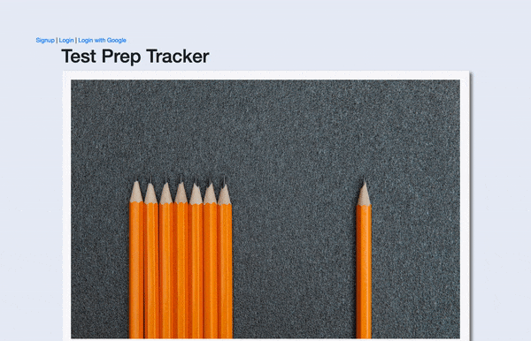

<h1 align="center">:books: Test Prep Tracker :pencil2:</h1>

An app to help users log and track their progress in preparing for graduate or professional exams. 
Check out the <a href="https://vimeo.com/509897295)">demo</a>.

## Built With:
* Ruby v2.6.1
* Rails v6.0.3 - MVC Web Framework
* PostgreSQL v0.18, 0.20 - Database
* OmniAuth Google
* Bootstrap 4.0.0

## Features

* Sign in/Sign up option with email or Google account authentication
* User can view and add to a list of graduate/professional tests for which they are preparing; includes search feature for finding specific tests
* User can view suggested test prep activities that other users have added, including descriptions and suggested time requirements, or add their own test prep activity
* Log practice sessions of study activities
* Track progress and performance until the test day

## Challenges
This was my first Rails project, so the challenges were numerous as I became familiar with a new language. The biggest challenge for me was understanding how to express logic in the Rails syntax. Something I thought would be relatively easy to implement took twice as long to implement.

## Future Implementations
In the future, I would like to try refactoring this project to incorporate React and Redux to challenge myself since I have learned additional languages since the time I completed this project.
